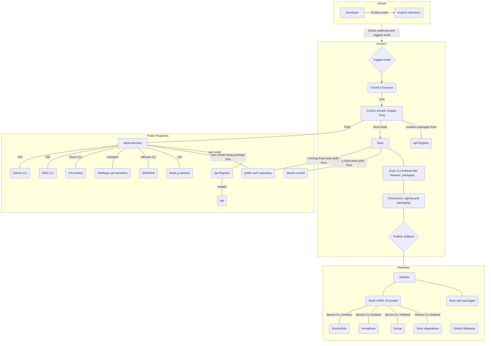

# WIP

Trying to capture Snyk CLI release pipeline.

```mermaid
flowchart TB
    subgraph GitHub
        direction LR
        developer--Pushes code-->repo
    end

    GitHub--Sends webhook and triggers build-->CircleCI

    subgraph CircleCI
        direction LR

        circle{Triggers build}

        circle-->executor(CircleCI Executor)
        executor--runs-->Docker(Circle's Docker images cimg)
        Docker--contains packages from---aptregistry(apt Registry)
        Docker--Runs tests-->Tests
        Tests---cliartifacts(Snyk CLI Artifacts like binaries, packages...)---signing(Checksums, signing and packaging)---publish{Publish artifacts}
    end

    Docker--Pulls---dependencies

    subgraph registries [Public Registries]
        dependencies--apt install---apt
        apt--Installs---pip
        dependencies--npm install using package-lock---npm
        dependencies--curl---nodejsorg
        dependencies--sdkman CLI---sdkman
        dependencies--curl/bash---shellspec
        dependencies--choco CLI---chocolatey
        dependencies--Orb---awscli
        dependencies--Orb---ghcli
        Tests--running Snyk tests pulls from---mavencentral
        Tests--running Snyk tests pulls from---npm
    end

    publish---releases

    subgraph releases [Releases]
      direction TB
      artifacts---awss3 & npmsnykpackage(Snyk npm packages)

      githubReleases(GitHub Releases)
      awss3--Serves CLI Artifacts---dockerhub(DockerHub)
      awss3--Serves CLI Artifacts---homebrew(Homebrew)
      awss3--Serves CLI Artifacts---scoop(Scoop)
      awss3--Serves CLI Artifacts---integrations(Snyk integrations)
    end

    repo(snyk/cli repository)
    npm(public npm repository)
    apt(apt Registry)
    nodejsorg(Node.js website)
    mavencentral(Maven central)
    sdkman(SDKMAN)
    shellspec(Shellspec git repository)
    awscli(AWS CLI)
    ghcli(GitHub CLI)
    chocolatey(Chocolatey)
    pip(pip)
    awss3(Snyk's AWS S3 bucket)
```
